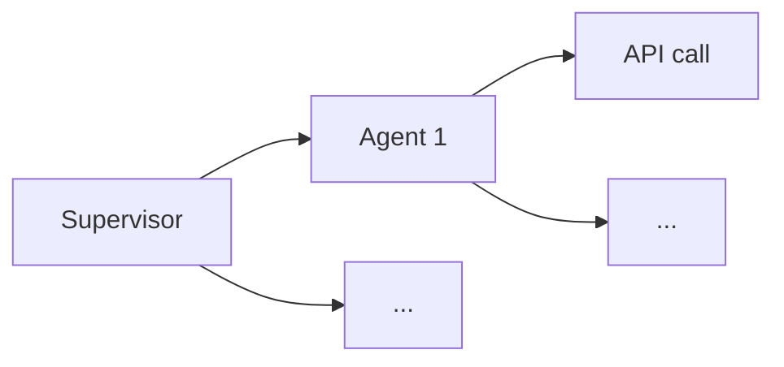
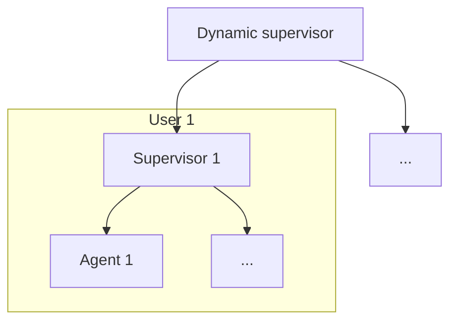
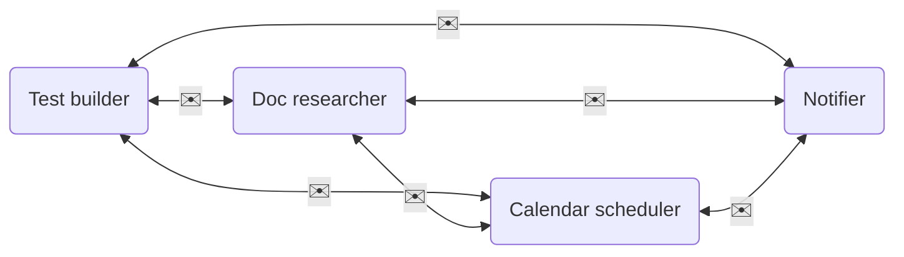
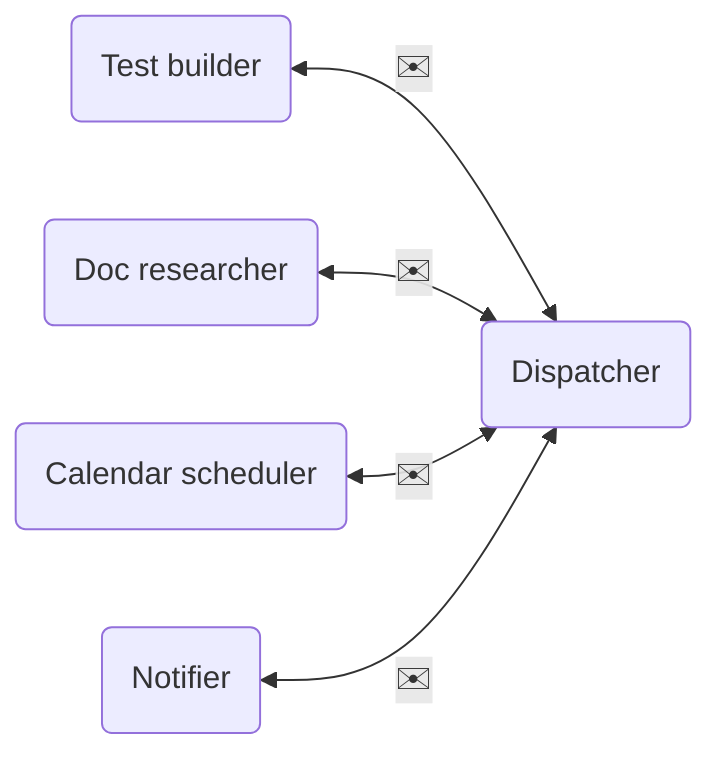
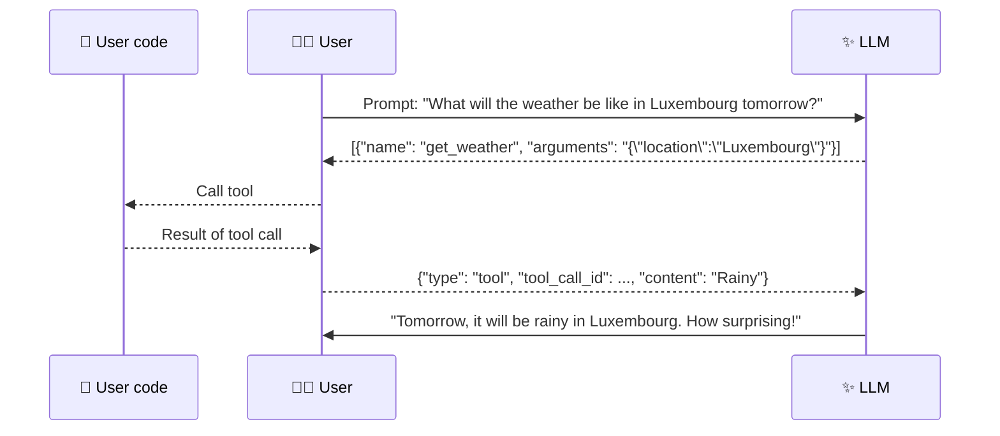

%{
draft?: true,
title: "👶🏼 Building baby's first AI agents with Elixir",
author: "Maxime Filippini",
tags: ["elixir", "ai", "agents", "otp"],
description: """
TBD TBD TBD TBD TBD
"""
}

---

For someone so interested in software and technology in general, my initial but
admittedly long-lasting aversion to AI tools has started to make me feel like a
luddite. While it is undeniable that Large Language Models ("LLMs") are
and will continue to be useful thanks to their vast body of "knowledge", and
their ability to answer our day-to-day queries, I am, to this day, a believer
that, when misused, these models and tools can get in the way of our own
learning, by providing a shortcut, a quick fix of dopamine that resembles true
learning.

After all, if someone uses LLMs so much that the layer of expert judgment
applied to the model's results becomes thinner and thinner, then it is my belief
that they are only delaying their own replacement. I have however become more
and more open to the idea of using LLMs in a way that will complement my
learning, and admittedly, some of that will include learning how to use LLMs as
well.

In this post, I will go over a simple exercise I have gone over while I am
learning the [Elixir language](https://elixir-lang.org/), using an AI-centric
example: **the use of AI agents**.

**Agents**, yet another buzzword at the center of the LLM craze these days, but
its concept brings on some interesting ideas to the forefront. First is the idea
of decentralizing/distributing AI workflows by delegating ownership of tasks and
resources to bespoke "entities" (i.e. the agents). Second is that, for agents
to be able to "act", i.e. perform actions that modify their environment
somewhat, we will have to bring a dash of **determinism** into a workflow
powered by LLMs, which are really **stochastic** in nature.

I will detail how the first idea, i.e. the separation of concerns as
well as their asynchronous nature, maps beautifully onto the Elixir ecosystem,
and try to explain that rationale along the way.

## What are agents?

The easiest way to understand agents is to think of them as human specialists,
making decisions, taking in from their environment, and taking actions, based
on external requests. In the past, such a system would be built with some kind
of Domain-Specific Language ("DSL") for user interactions, and a pre-defined set
of possible interactions. These systems would most likely end up becoming
hyper-specialized and hard to maintain.

Of course, LLMs are great for parsing language inputs (the requests), but they
can't access the outside world. For that, agents will have to be given access to
"tools", but when to use which tool will have to be governed by the LLM. In
addition, it is quite common for agents to have some form of "memory", allowing
them to "remember" user preferences and methods for processing requests.

We represent the components of an agent in the diagram below.


The runtime component is the "glue" layer connecting the agent's memory and
available tools to the LLM, bringing it all together into a cohesive whole.

## Elixir for agent systems

What makes Elixir such a strong choice for building agent systems isn't only the
language itself, but also its runtime (Elixir compiles down to Erlang bytecode,
executed by the "[BEAM](<https://en.wikipedia.org/wiki/BEAM_(Erlang_virtual_machine)>)").

As shown in the previous diagram, agents are encapsulated systems that
communicate with the outside world using messages (responses to prompts). This
matches quite well with the core idea behind [OTP](https://en.wikipedia.org/wiki/Open_Telecom_Platform),
the framework behind the BEAM and Erlang.

OTP applications are based around **processes**, tiny threads of synchronous
execution managed and scheduled by the BEAM. It is how those applications manage
to handle massive concurrency and fault tolerance. These processes being so
light (only a few kilobytes), we can afford to spawn thousands of them,
separating concerns to a high degree. While many processes will be involved in
actually performing work ("worker processes"), fault tolerance will only be
achieved if we have a good way to handle situations where these processes crash.
This is mostly obtained by having processes that supervise other processes
("supervisor processes"). By linking supervisor and worker processes, a crash
on the worker process will lead to a message being sent to the supervisor, which
can then spawn a new worker process to take its place.

To make working with processes easier, OTP gives us several constructs:

- `GenServer` is a simple server-like process that can handle synchronous and
  asynchronous messages;
- `Supervisor` is a process that monitors and restarts child processes based on
  a pre-defined strategy;
- `Task` is a lightweight abstraction to run a single function asynchronously in
  its own process.

Our use of these constructs will be the following:

- Each agent will be written as a `GenServer`, since we want stateful,
  long-running processes to whom we want to send messages for processing.
- We will use `Task`s to fire off API requests to avoid blocking the agent,
  since those can take quite a while to complete.
- A `Supervisor` will be used to supervise all of the agents.

Our **supervision tree** will be quite simple, i.e.

<center>



</center>

Should we want to extend the app to let multiple users connect to it, then we
would most likely use a [`DynamicSupervisor`](https://hexdocs.pm/elixir/DynamicSupervisor.html),
to supervise one supervisor per user, which itself would supervise agents
dedicated to the user.

<center>



</center>

## Our set up

As previously discussed, each agent will be modelled as a `GenServer`.

```elixir

```

I mentioned earlier that LLMs can be configured to use tools. These tools are
function calls, and those functions can either live in your code or be run
via the LLM API. For example, OpenAI supports the following tools out of the
box:

- Web search;
- Image generation;
- File search; and
- Code interpreter.

While these tools can be accessed via the API, we are going to limit ourselves
to calling our own functions here, mostly to limit cost for now.

Running our own functions will also allow us to do a key thing in our agent
system that I haven't touched on so far: **Handing off the conversation to
another agent**.

Imagine an agent's work as a loop, where each iteration corresponds to a
prompt for one piece of the work to be performed. In order for the work to
complete, we have to make sure that the LLM can instruct us to either stop
completely, or hand the conversation off to another agent to continue the work.

Here is

---

## The objective

I want to dedicate more time to learning Elixir and web technologies in general,
and for that to happen, I will need a little bit of help in selecting learning
materials, building tests for me to test my knowledge, and blocking my
calendar for learning and testing myself.

## The set up

### Processes and agents

Elixir is built on top of the BEAM, the Erlang virtual machine, which means we
can leverage on the "Open Telecom Platform", or OTP for short, which is a set
of Erlang libraries and constructs that allow for designing fault-tolerant,
highly concurrent applications.

This fault tolerance is obtained by the use of **processes**, i.e. light-weight
threads of executions with isolated memory. Because there is no memory shared
between processes, they have to communicate with each other by passing messages.

It is important to note that these processes are not Operating System ("OS")
processes, and as such, we can spawn thousands and thousands of them, and we can
manage them from within our code, without having to defer to the OS layer (e.g.
using `systemd`).

There are two general kinds of these processes: those that perform some work
(worker processes), and those that supervise that work (supervisor processes).
The latter allow us to spawn new worker processes as well as handle their
crashes or planned exits.

This is a great abstraction for AI agents, since it will allow us to segregate
them into different processes, and have them communicate via each other with
messages, as long as we have allowed them to do so.

We could choose to connect each process together by allowing them to send
messages to all other "agent processes" after handling their own messages, like
below

<center>



</center>

or we could plug all of these agents into another process whose job will be
to determine which agent to pass a message to (a "dispatcher").

<center>



</center>

### Our plan

Each agent will be set up as a [GenServer](https://hexdocs.pm/elixir/GenServer.html)
that can take in a prompt (the issuer of the prompt may be the user or another
agent). When a prompt is received, an API call is made with the prompt and the
previous message history. If the API response includes **tool calls** (more on
that later), the agent will run these tools, send the results of these tools
back to the API, and get the response back.

### LLM integration

While Elixir has libraries that allow us to run pre-trained AI models (e.g.
[Bumblebee](https://hexdocs.pm/bumblebee/Bumblebee.html)), each agent will be
calling an LLM API (e.g. OpenAI). To allow for communication with the other
agents, we will use the "**function calling**" mechanism from the API.

#### Article

- What is an agentic system?
- Concepts required for AI agents (API, tools, ReAct, memory, etc.)
- Concepts in Elixir
- How to put it all together
- Example

## What is an agent system?

The easiest way to understand agents is to think of them as human specialists,
making decisions, taking in from their environment, and taking actions.
Building such a computer program in the traditional sense is no easy task, as
we would have to effectively encode all possible criteria for decisions, every
way by which the environment is to be understood (parsed), as well as every
single action.

This is where LLMs come in, as their stochastic nature allows us to be
quite loose with the requirements, yet still lets us define "rules" in the form
of **tools**, where we really need determinism.

A tool provided to an LLM is nothing more than a function specification,
provided in JSON format, which will give sufficient information for the LLM to
"decide" to use the tool in its process of answering a user's prompt.

Here is an example of such a function specification, lifted from the OpenAI API
documentation:

```json
{
  "type": "function",
  "name": "get_weather",
  "description": "Get current temperature for a given location.",
  "parameters": {
    "type": "object",
    "properties": {
      "location": {
        "type": "string",
        "description": "City and country e.g. Bogotá, Colombia"
      }
    },
    "required": ["location"],
    "additionalProperties": false
  }
}
```

But where is this tool actually how can an LLM make use of such a tool? The role
of the LLM is to know **when it should use the tool**, but the use of the tool
itself is delegated back to our own code, which gives us a great deal of
flexibility in terms of how we define these tools. They could, for example, be
external services (specialized APIs), bespoke scripts, or even functions defined
in the same codebase that is orchestrating the LLM calls.

The process is illustrated in the sequence diagram below:

<center>



</center>

Because the t
