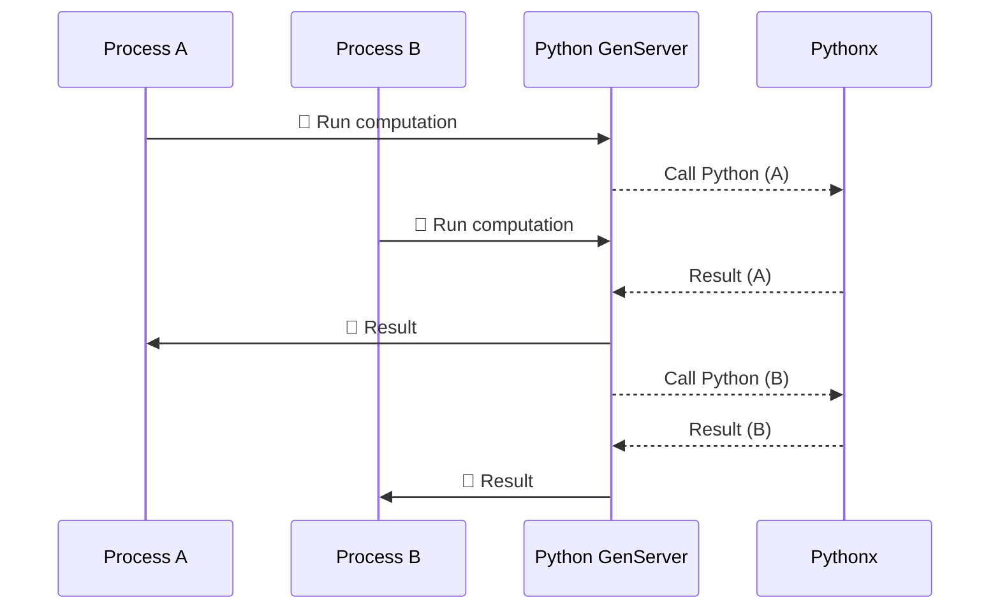

%{
title: "👩🏽‍🚀 Data exploration in Elixir",
author: "Maxime Filippini",
tags: ["elixir", "data analysis"],
description: """
TBD TBD TBD TBD
"""
}

---

<!--

    Intro

Over the years, I've gone to know Python quite well from working in finance.
But lately, I've been inching more and more towards functional languages, as
they are much nicer to write. After a quick stint with Gleam, I've now dove
deep into Elixir. -> Much wider ecosystem, and a compelling macro system.

Elixir brings a certain kind of pleasure that i'm not getting with Python. The
Phoenix web framework is part of it. In addition, the concurrency model of Elixir
I find quite exciting.

As I want to apply Elixir to domains that I know well (finance and risk management),
I am sitting wondering whether Elixir could be a good fit for modelling these
domains, or whether I will still need to partly rely on Python for these
applications.

In this post, I go over the existing Elixir ecosystem, and try to fill gaps
as much as possible before building those applications

    Data exploration

I have never heard of someone using the Python shell to explore data. Although
it is technically possible, the experience really leaves a lot to be desired.
Instead, most people working with data will use Jupyter notebooks to analyze
data, build models, and prepare visualizations.

Elixir has a similar tool up its sleeve, but on steroids: Livebook.

- Supports markdown and LaTeX out of the box, just like Jupyter notebooks
- Runs in a predictable order. It detects stale cells and reruns them if needed.
- Full-on application environment. You can run web servers.
- Interactivity at its core. Smart cells can do many things, from plotting charts,

Let's take a look.

Load a csv - plot the chart. Update the data, chart updates.


 -->

Over the years, I’ve grown quite comfortable with Python, mostly during my work
as a risk manager. It’s a language I know well and have relied on for building
data processing pipelines, risk measurement libraries, but also for automating
some of the boring stuff, like scraping the web or assembling PDF from e-books
for offline studying.

But as time has gone on, I’ve found myself increasingly drawn to functional
languages, both for their elegance and for the different mindset they encourage
when designing software. It is during this exploration that I have discovered
the languages running on the BEAM (the Erlang virtual machine), such as Gleam
and Elixir.

On top of the avoidance of side effects and the wonderful [pipe operator](https://hexdocs.pm/elixir/enumerable-and-streams.html#the-pipe-operator), these languages
boast an incredibly compelling concurrency model thanks to the BEAM, where
spawning super lightweight processes to run code asynchronously is as simple as
writing:

```elixir
x = 10
spawn(fn -> x ** 2 end) # This code runs in a separate process from the main code
```

Elixir also brings a powerful macro system that transforms the Elixir AST at
compile time, and make writing code more compact. For example, a route definition
in the scope of a web-server controller could be written as such (see [`Plug.Router`](https://hexdocs.pm/plug/readme.html#plug-router)).

```elixir
get "/hello" do
  send_resp(conn, 200, "world")
end

match _ do
  send_resp(conn, 404, "oops")
end
```

But I work in financial risk management, an area that requires of a programming
language to provide data exploration capabilities, numerical computing packages
with decent performance, as well as good tooling.

**Can Elixir tick those boxes?** Would Python still be needed even if we build
an entire web application in Elixir using the amazing [Phoenix](https://www.phoenixframework.org/)
framework? In this post, I take a closer look at Elixir’s ecosystem with those
questions in mind, to determine whether Elixir can truly encompass all of my
future needs.

## Numerical computing

In the last few years, the Elixir team has made a large effort to bridge a gap
identified in BEAM languages: _the lack of libraries and tooling for numerical
computing_. The fault tolerance, high concurrency, and distribution capabilities
of the BEAM makes it a great target for implementing machine learning algorithm,
as long as the linear algebra toolbox is there.

This is why `Nx` ("Numerical Elixir") was born.

`Nx`'s main contribution is the definition of **tensors** in Elixir (i.e.
multi-dimensional arrays), as well as operations on these tensors. For example,
defining a vector and computing the differences between neighbors can be written:

```elixir
Nx.tensor([1, 6, 7, 4, 3, 2, 8, 3])
|> Nx.diff()
|> IO.inspect()

#   #Nx.Tensor<
#     s32[7]
#     [5, 1, -3, -1, -1, 6, -5]
#   >
```

This also includes the ability to generate random tensors based on pre-defined
distributions:

```elixir
{arr, _new_key} =
  Nx.Random.key(1)
  |> Nx.Random.normal(0, 1, shape: {500})

IO.inspect(arr)

#    #Nx.Tensor<
#    f32[500]
#    [-1.9280794858932495, -0.8847223520278931, 2.186722993850708, ...]
#    >
```

<p class="p-4 italic rounded-lg bg-violet-100">
If you're wondering what "keys" are in this context, think of them as the state
of the pseudo-random number generator ("PRNG" for short). We start by generating
a key using an integer seed (here, 1), and generating a vector will also
generate a new key. Should we wish to generate a new vector, backed by the same
initial seed, we would use that new key to do so.
</p>

To make operations on tensors efficient, `Nx` allows us to **stage** numerical
definitions, turning them into computation graphs that will then be compiled
and optimized, for example to run on the GPU. For example, the `substract`
function in the following code uses the `defn` macro (as opposed to `def`, which
is used for normal Elixir functions) provided by `Nx.Defn` to make it operate
on tensors, and compile it for efficient use.

```elixir
defmodule TensorMath do
  import Nx.Defn

  defn subtract(a, b) do
    a - b
  end
end
```

Finally, `Nx` also provides auto-differentiation for functions defined using
`defn`, which is useful for optimization of models. Here is a trivial example
using a quadratic polynomial.

```elixir
defmodule Quadratic do
  import Nx.Defn

  defn f(x, a, b, c) do
    a * x ** 2 + b * x + c
  end

  defn gradient(x, a, b, c) do
    grad(fn x -> f(x, a, b, c) end).(x)
  end
end

{a, b, c} = {1, 2, 3}
x = 0

Quadratic.gradient(x, a, b, c) |> Nx.to_number() |> IO.inspect()
# 2.0

IO.inspect(2 * a * x + b)
# 2
```

Based on these features, I'd say `Nx` is very capable of powering our calculation
engines!

### Pythonx

The whole purpose of this post is to establish whether working on finance
applications in Elixir would force me to maintain a separate Python layer, or
if I could do all my work in Elixir, a language I am more fond of these days.

But such a question does not have a binary answer. For example, while `Nx` seems
like a great numerical computing library, re-implementing all of the algorithms
available in Python may be cost prohibitive. But what are our options then?

1. Call `python` via `System.cmd`. This approach is not ideal because retrieving
   function outputs may be difficult (parsing `STDOUT` would lead to a loss of context)
2. Maintain a separate Python service, running in Docker. This approach also
   has drawbacks, as it would require the set up of a deployment pipeline as well
   as an API layer.

As it turns out, there is a third option, [Embedding Python](https://docs.python.org/3/extending/embedding.html),
using the fact that CPython is also provided as a C library with a documented interface,
and the ability of Elixir/Erlang to use Native Implemented Functions (or "NIFs" for short).

That way, we can run Python within the same OS process as the BEAM, and
translate Elixir variables to Python variables and vice versa. And we don't even
have to worry about setting a Python environment separately, as we can directly
supply a `pyproject.toml` specification and run `uv` from within our Elixir code
to initialize the interpreter.

```elixir
Pythonx.uv_init("""
[project]
name = "project"
version = "0.0.0"
requires-python = "==3.13.*"
dependencies = [
  "scipy==1.15.3"
]
""")

# Using CPython 3.13.1
# Creating virtual environment at: .venv
# Resolved 3 packages in 342ms
# Installed 2 packages in 47ms
#  + numpy==2.3.0
#  + scipy==1.15.3
# :ok
```

Because of the Global Interpreter Lock ("GIL") however, we unfortunately cannot
reasonably expect concurrency via the BEAM by running `Pythonx` in multiple
BEAM processes. For quick evaluation of Python functions, we can define a single
Python "service", modelled as a [`GenServer`](https://hexdocs.pm/elixir/1.12/GenServer.html),
which will receive messages from other BEAM processes and process those messages
synchronously.

Such a set up would lead to the following sequence of events taking place if
two separate processes were to ask for Python calculations to be done.



In the example below, I define such a GenServer that can compute the "percent
point function" (or "PPF", or "quantile") for some probability distributions,
by calling the appropriate functions in the `scipy.stats` package.

```elixir
defmodule Py do
  use GenServer

  @code_head """
  from scipy import stats

  """

  # Start the GenServer
  def start_link do
    GenServer.start_link(__MODULE__, %{globals: %{}}, name: __MODULE__)
  end

  # Compute the quantile of a normal distribution
  def norm_ppf(q, loc \\ 0, scale \\ 1) do
    GenServer.call(
      __MODULE__,
      {:ppf, "stats.norm.ppf(q, loc, scale)", %{"loc" => loc, "scale" => scale, "q" => q}}
    )
  end

  # Compute the quantile of a Student-t distributio n
  def t_ppf(q, dof \\ 1) do
    GenServer.call(
      __MODULE__,
      {:ppf, "stats.t.ppf(q, dof)", %{"dof" => dof, "q" => q}}
    )
  end

  # Callback functions
  @impl true
  def init(init_arg) do
    {:ok, init_arg}
  end

  @impl true
  def handle_call({:ppf, code, params}, _from, state) do
    # Python code to be executed
    code =
      """
      #{@code_head}

      #{code}
      """

    # Evaluate the code via Python code
    {res, _globals} = Pythonx.eval(code, params)

    # Reply to the caller with the decoded output
    {:reply, Pythonx.decode(res), state}
  end
end

```

## Data exploration

In my mind, exploring data requires the use of several tools:

- Some kind of cell-based editor, or at the very least a shell with command
  history and variable explorer.
- A construct and library for working with tabular data (e.g. dataframes).
- A library for constructing graphs.

In Python, these boxes are all ticked, as any Python user working with data
would be very familiar with tools like **Jupyter notebooks**, `pandas` or `polars`,
and `matplotlib`.

| Aspect            | Tools                                 | Covered |
| ----------------- | ------------------------------------- | ------- |
| Editor            | Jupyter notebooks, JupyterLab, Spyder | ✅      |
| Dataframe library | `pandas`, `polars`                    | ✅      |
| Graphs library    | `matplotlib`, `seaborn`, `plotly`     | ✅      |

### Livebook

Livebook is a web-based interactive notebook application built for Elixir.
Much like Jupyter notebooks in the Python ecosystem, Livebook enables us to
combine code, text, and visualizations in a single, executable document.

However, Livebook

### Dataframes, in Elixir

Working with tensors is great, but in many situations, we will not need to
work in multi-dimensional space, and instead, we will have **tabular data**,
i.e. a set of **labelled**, 1-dimensional arrays. In Python, the excellent
`pandas` allows us to deal with that type of data quite easily, providing
convenience functions and tools right at our fingertips.

In Elixir, we have [`Explorer`](https://hexdocs.pm/explorer/Explorer.html),
which is built on `polars`, but does not aim to match it in terms of
API. It has an extensive query engine, and can integrate with our `Nx` numerical
definitions.

We show the syntax of its query engine below with an admittedly contrived
example.

```elixir
require Explorer.DataFrame, as: DF
require Explorer.Series, as: DF

# Define a new dataframe
DF.new(%{
  a: [1, 2, 3, 4, 5, 6],
  b: [3, 3, 4, 4, 5, 5]
})

# Add a computed column via a lazy computation
|> DF.mutate(c: a - b)

# Use conditionals to build new columns
|> DF.mutate(
  d:
    cond do
      c > 0 -> 1
      c < 0 -> -1
      true -> 0
    end
)

# Apply functions that operates on series directly
|> DF.mutate(ee: exp(d))

# Apply Elixir/Erlang functions on each element
|> Kernel.then(fn df ->
  df
  |> DF.put(
    :ff,
    DS.transform(df["ee"], fn x ->
      :math.sqrt(x)
    end)
  )
end)

# Apply a function that operates on tensors
|> Kernel.then(fn df ->
  df
  |> DF.put(
    :gg,
    TensorMath.subtract(df["a"], df["b"])
    |> DS.from_tensor()
  )
end)

# Filter based on column values
|> DF.filter(a < 4)

# Only keep some columns based on a function evaluation
|> DF.select(fn c -> String.length(c) == 2 end)

# Display the table
|> DF.print()

#   +--------------------------------------------------+
#   |    Explorer DataFrame: [rows: 3, columns: 3]     |
#   +---------------------+--------------------+-------+
#   |         ee          |         ff         |  gg   |
#   |        <f64>        |       <f64>        | <s64> |
#   +=====================+====================+=======+
#   | 0.36787944117144233 | 0.6065306597126334 | -2    |
#   +---------------------+--------------------+-------+
#   | 0.36787944117144233 | 0.6065306597126334 | -1    |
#   +---------------------+--------------------+-------+
#   | 0.36787944117144233 | 0.6065306597126334 | -1    |
#   +---------------------+--------------------+-------+
```

As you can see, the syntax is very elegant. While the library does not seem to
be as feature-complete as polars' expression system, we can get quite close by
bringing in external functions, either to operate on individual values or on
column tensors.

In the example below, we compute the result of the [Kupiec POF test](https://nl.mathworks.com/help/risk/overview-of-var-backtesting.html)
on a rolling window basis, by bringing in the `Statistics.Distributions.Chisq`
module for the computation of the p-values.

```elixir
require Explorer.DataFrame, as: DF
require Explorer.Series, as: DS

{arr, _new_key} =
  Nx.Random.key(1)
  |> Nx.Random.uniform(shape: {5000})

var_cf = 0.99
th_os = 1 - var_cf
window = 250
test_cf = 0.95
pvalue_cutoff = 1 - test_cf

DF.new(%{
  rand: DS.from_tensor(arr)
})

# Define overshootings based on the outcome of random uniform sampling
|> DF.mutate(
  os:
    cond do
      rand < ^th_os -> 1
      true -> 0
    end
)

# Aggregate over 250-day windows
|> DF.mutate(n_os: window_sum(os, ^window))

# Remove while the first window is being built
|> DF.slice((window - 1)..-1//1)

# Add intermediate columns for calculations
|> DF.mutate(
  th_os: ^th_os,
  n_obs: ^window,
  f_os: n_os / ^window
)

# Compute the Kupiec likelihood ratio
|> DF.mutate(
  num: th_os ** n_os * (1 - th_os) ** (n_obs - n_os),
  denom: f_os ** n_os * (1 - f_os) ** (n_obs - n_os)
)
|> DF.mutate(kupiec_lr: -2 * log(num / denom))

# Compute the p-value for each value of the likelihood ratio
|> Kernel.then(fn df ->
  DF.put(
    df,
    :p_value,
    DS.transform(
      df["kupiec_lr"],
      fn x ->
        1 - Statistics.Distributions.Chisq.cdf(1).(x)
      end
    )
  )
end)
|> DF.filter(p_value < ^pvalue_cutoff)
|> DF.print()
```

---

## Numerical Elixir

Numerical Elixir, or `Nx` for short, is a library that brings the concept of
"tensors" (multi-dimensional arrays) to Elixir, the lowest level abstraction
used in numerical work. It also allows to compile Elixir to the GPU for faster
computations, and supports automatic differentiation, making it more than a
`numpy` replacement.

Let's define a tensor and compute the difference between successive numbers.

```elixir title="hi"
Nx.tensor([1, 6, 7, 4, 3, 2, 8, 3])
|> Nx.diff()
|> IO.inspect()

#   #Nx.Tensor<
#     s32[7]
#     [5, 1, -3, -1, -1, 6, -5]
#   >
```

Simple enough, right?

For something a bit more complicated, let's generate a random vector using
a normal distribution, and compute the 95th percentile.

Simulating random data is done via the [`Nx.Random`](https://hexdocs.pm/nx/Nx.Random.html)
module:

```elixir
{arr, _new_key} =
  Nx.Random.key(1)
  |> Nx.Random.normal(0, 1, shape: {500})

IO.inspect(arr)

#    #Nx.Tensor<
#    f32[500]
#    [-1.9280794858932495, -0.8847223520278931, 2.186722993850708, ...]
#    >
```

If you're wondering what "keys" are in this context, think of them as the state
of the pseudo-random number generator ("PRNG" for short). We start by generating
a key using an integer seed (here, `1`), and generating a vector will also
generate a new key. Should we wish to generate a new vector, backed by the same
initial seed, we would use that new key to do so.

Right now, `Nx` does not cover many distributions (especially when comparing it
to `scipy.stats`), but we could realistically implement our own functions to
perform the necessary Probability-Integral Transforms ("PIT").

While `Nx` has quite a few pre-built functions, it doesn't have as many as
`numpy` for example. Let's build a `Stats` module that will include utility
functions needed to illustrate the power of Elixir for data exploration.

```elixir
defmodule Stats do
  import Nx.Defn

  defn quantile(t, q) do
  end

  defn ecdf(t) do
  end
end
```

In the stubbed module, we can already notice two things:

- `import Nx.Defn` indicates that our code is a numerical definition, and that
  it needs to be traced so that it can be compiled and optimized.
- Functions are defined using `defn` instead of `def`, which converts Elixir
  constructs inside the functions into a sub-scope of the language that operates
  on tensors. Within such a function `a / b` will be the element-wise division
  on tensors instead of the scalar division.

The function for the `quantile/2` function is quite basic:

- We start by sorting the array;
- We then find which fractional index would match our quantile;
- Because that index is most likely not going to be an integer, we perform a
  linear interpolation to find the empirical quantile.

```elixir
defmodule Stats do
  import Nx.Defn

  defn quantile(t, q) do
    sorted = Nx.sort(t)
    {n} = Nx.shape(sorted)

    # The exact fractional index for our quantile
    idx = Nx.multiply(Nx.as_type(n - 1, :f32), q)

    # Linear interpolation
    lower = Nx.floor(idx) |> Nx.as_type({:s, 64})
    upper = Nx.ceil(idx) |> Nx.as_type({:s, 64})

    v0 = Nx.take(sorted, lower)
    v1 = Nx.take(sorted, upper)

    w = idx - Nx.floor(idx)
    v0 * (1 - w) + v1 * w
  end
end
```

The empirical cumulative distribution function is also quite straightforward:

```elixir
defmodule Stats do
  # ...

  defn ecdf(t) do
    sorted = Nx.sort(t)
    {n} = Nx.shape(sorted)
    nf = Nx.as_type(n, :f32)

    ones = Nx.broadcast(1.0, {n})
    cumcounts = Nx.cumulative_sum(ones)

    ps = cumcounts / nf

    # We re-obtain the indexes of the original tensor
    sorted_indices = Nx.argsort(t)
    inv_indices = Nx.argsort(sorted_indices)

    # We re-index the probabilities to get those in the original order
    Nx.take(ps, inv_indices)
  end

end
```

## Data exploration

Working with tensors is great, but in many situations, we will not need to
work in multi-dimensional space, and instead, we will have **tabular data**,
i.e. a set of **labelled**, 1-dimensional arrays. In Python, the excellent
`pandas` allows us to deal with that type of data quite easily, providing
convenience functions and tools right at our fingertips.

But there is a new kid on the block. `polars` is a Rust library with Python
bindings that provides a much nicer (in my opinion) user experience when
building data processing pipelines. Because it is not a Python-native library,
it was only a matter of time before bindings for other languages started popping
up. Enter [`Explorer`](https://hexdocs.pm/explorer/Explorer.html), Elixir's
very own data exploration library.

Let's try to take our simulated random vector, compute the `ecdf` and put it all
in a single **dataframe**.

```elixir
require Explorer.DataFrame, as: DF
require Explorer.Series, as: DS

ds = DS.from_tensor(arr)

df =
  DF.new(%{
    idx: DS.row_index(ds),
    sims: ds,
    ecdf: ds |> Stats.ecdf() |> DS.from_tensor()
  })

df
|> DF.print()

#    +----------------------------------------------------+
#    |    Explorer DataFrame: [rows: 500, columns: 3]     |
#    +-------+----------------------+---------------------+
#    |  idx  |         ecdf         |        sims         |
#    | <u32> |        <f32>         |        <f32>        |
#    +=======+======================+=====================+
#    | 0     | 0.024000000208616257 | -1.9280794858932495 |
#    | 1     | 0.17599999904632568  | -0.8847223520278931 |
#    | 2     | 0.984000027179718    | 2.186722993850708   |
#    | 3     | 0.13199999928474426  | -1.0671522617340088 |
#    | 4     | 0.7940000295639038   | 0.7586699724197388  |
#    +-------+----------------------+---------------------+
```

Say we want to identify the left tail of the empirical distribution. Let's add a
column that marks the relevant data points. To do so, we **mutate** the original
dataframe, adding a column called `tail`, defined based on a conditional. For that,
we can use the Elixir `cond` construct, which goes to the first branch that evaluates
to `true`.

```elixir
df
|> DF.mutate(
  tail:
    cond do
      ecdf < 0.05 -> true
      true -> false
    end
)
|> DF.print()

#   +----------------------------------------------------------------+
#   |          Explorer DataFrame: [rows: 500, columns: 4]           |
#   +-------+----------------------+---------------------+-----------+
#   |  idx  |         ecdf         |        sims         |   tail    |
#   | <u32> |        <f32>         |        <f32>        | <boolean> |
#   +=======+======================+=====================+===========+
#   | 0     | 0.024000000208616257 | -1.9280794858932495 | true      |
#   | 1     | 0.17599999904632568  | -0.8847223520278931 | false     |
#   | 2     | 0.984000027179718    | 2.186722993850708   | false     |
#   | 3     | 0.13199999928474426  | -1.0671522617340088 | false     |
#   | 4     | 0.7940000295639038   | 0.7586699724197388  | false     |
#   +-------+----------------------+---------------------+-----------+
```

To filter and only retain the tail, we could now do:

```elixir
df
|> DF.filter(tail == true)
|> DF.print()

#   +----------------------------------------------------------------+
#   |           Explorer DataFrame: [rows: 24, columns: 4]           |
#   +-------+----------------------+---------------------+-----------+
#   |  idx  |         ecdf         |        sims         |   tail    |
#   | <u32> |        <f32>         |        <f32>        | <boolean> |
#   +=======+======================+=====================+===========+
#   | 0     | 0.024000000208616257 | -1.9280794858932495 | true      |
#   | 39    | 0.004000000189989805 | -2.4354138374328613 | true      |
#   | 88    | 0.009999999776482582 | -2.26308536529541   | true      |
#   | 90    | 0.03799999877810478  | -1.7967510223388672 | true      |
#   | 145   | 0.029999999329447746 | -1.8722012042999268 | true      |
#   +-------+----------------------+---------------------+-----------+
```
