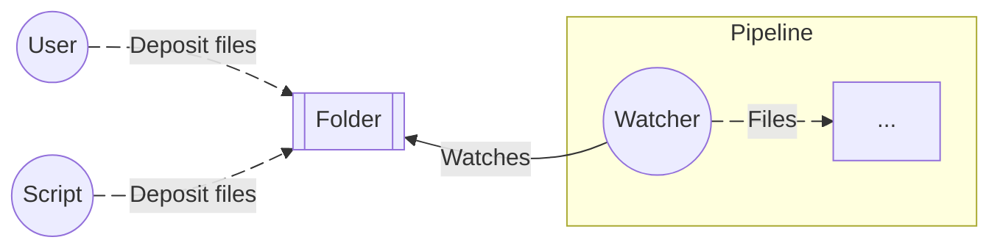

%{
draft?: false,
title: "📄 Building a document factory in Elixir",
author: "Maxime Filippini",
tags: ["elixir", "automation", "pipeline", "documents", "pdf"],
description: """
TBD
"""
}

---

<!--

Description of the application, its objectives. What features of Elixir does it use?

Building a data pipeline
  Why a data pipeline?
  Base principles of genstage
  Our code

Building documents


-->

In the [last post](/posts/2025/06-19-elixir-for-frm-apps.html), we explored the feasibility of using Elixir to build finance and risk management application, via libraries like `Nx`, `Pythonx`, `VegaLite` and tools like Livebook. In this post, we stay a little bit closer to Elixir's wheelhouse, by building a **document factory**, a service that will build PDFs according to a pre-defined format and user-supplied data.

This kind of application is quite common in finance, where regulation requires adequate communication of product specificities as well as risk measures. Often, said communication is done in the form of a standardized document, filled with proprietary data.

If you're interested in seeing how we can build these document templates, how we can render them to PDFs, and how we can build this whole process as a robust data pipeline in Elixir, this post is for you! Let's get into it.

## Our objectives and high level technical considerations

Our objectives with this application are rather simple:

<div class="p-4 font-bold text-center align-middle bg-white border rounded-lg border-violet-300">
Be able to generate a large number of documents, on request, with consistent throughput, with a flexible solution for writing templates.
</div>

Our basic document template will be for a "factsheet" of sort, as shown below:


Our strategy for building PDF documents is one that will be very familiar to anyone having undertaken that kind of work: **build an HTML document first, and a [headless browser](https://en.wikipedia.org/wiki/Headless_browser) to render it to PDF**.

How will our users request the building of documents? We will keep it simple and have our application watch a specific folder for files whose name match a certain pattern. This is not too dissimilar to how we would set this up in a production environment, for example by hooking into events on an S3 bucket.

In order to ensure consistent throughput and avoid any bottlenecks in our document generation jobs, our application will take the form of a **data pipeline**, where concurrent computations will be given the appropriate amount of resources based on how much work they can handle.

In the next sections, we will first go over how we can go and build our documents in a programmatic way, to then focus on putting together the pipeline, and cap it all off with a few test runs with realistic loads.

## Building documents

In this section, we provide one approach of automating document creation. This approach is quite commonplace and anyone who has worked in that space will feel right at home!

### How to build PDF documents in Elixir

Generating PDFs is generally done in the same way in every language these days, and leverages on the ability of browsers to take a web-page and save it to a PDF document.

<div class="flex items-center justify-center w-full h-96">
  
</div>

This process of saving a webpage can be automated by controlling a "[headless browser](https://en.wikipedia.org/wiki/Headless_browser)" in our programs. By invoking the "Save as PDF" command on a pre-built html document, we should be able to obtain a PDF file with the same layout and styles.

**But browsers are mostly made for rendering web pages**, so we will build our document as a print-friendly web-page first. Our process will look a little bit like this:

<center>


</center>

To run a headless browser in Elixir for the specific purpose of building PDF documents, we use [`ChromicPDF`](https://hexdocs.pm/chromic_pdf/ChromicPDF.html), a library that has the advantage of not relying on [`Puppeteer`](https://pptr.dev/), a very well-known open-source tool that requires NodeJS to run.

`ChromicPDF` works by launching a Chrome process as well as a pool of targets that will be running the PDF conversion jobs. This pool is then attached to our application, which supervises it, thus enabling concurrency and fault tolerance, as per the BEAM principles.

Our application entry point would therefore look like the following:

```elixir
defmodule Docmaker.Application do
  use Application

  @impl true
  def start(_type, _args) do
    children = [
      {ChromicPDF, chromic_pdf_opts()}
      # ...
    ]

    opts = [strategy: :one_for_one, name: Docmaker.Supervisor]

    # Our application is actually a supervisor process that is
    # supervising other child processes, including the one started
    # by ChromicPDF.
    Supervisor.start_link(children, opts)
  end

  # You don't have to worry about these options. These are there just to
  # make sure ChromicPDF runs smoothly. These should be tuned to the
  # machine the code is running on.
  defp chromic_pdf_opts do
    [
      session_pool: [
        size: 10,
        timeout: 10_000,
        checkout_timeout: 5_000,
        max_uses: 1000
      ]
    ]
  end
end
```

To turn an existing HTML document into a PDF within our application is then
very simple:

```elixir
defmodule Examples.Conversion do
  @doc """
  Convert an HTML file to a PDF.
  """
  def convert_file(path_to_html, path_to_pdf) do
    ChromicPDF.print_to_pdf({:file, path_to_html}, output: path_to_pdf)
  end

  @doc """
  Convert an HTML string to a PDF.
  """
  def convert_string(html, path_to_pdf) do
    ChromicPDF.print_to_pdf({:html, html}, output: path_to_pdf)
  end
end
```

Because `ChromicPDF` uses [`NimblePool`](https://hexdocs.pm/nimble_pool/NimblePool.html) under the hood, we do not have to manage the Chrome session ourselves, and instead, we simply call `print_to_pdf` which will call the appropriate resource to do the work. To stay concurrent however, we need to make sure these function calls are performed by different BEAM processes.

We show a simple implementation for processing a list of HTML files below, using `Task.async_stream` to spawn new single-purpose processes, and then `Enum.to_list` to collect the outputs.

```elixir
defmodule Examples.Conversion do
  # ...

  def convert_many_files(html_paths, pdf_paths) do
    Enum.zip(html_paths, pdf_paths)
    # Perform asynchronous PDF conversions
    |> Task.async_stream(fn {html_path, pdf_path} ->
      ChromicPDF.print_to_pdf({:file, html_path}, output: pdf_path)
    end)
    # Collect the results
    |> Enum.to_list()
  end
end
```

### Building HTML documents

Depending on the complexity of HTML documents, one may start by considering
interpolating Elixir variables directly into a string. For example:

```elixir
defmodule Examples.Html do
  def interpolation(doc_title, body, output) do
    html = """
    <!DOCTYPE html>
    <html lang="en">
      <head>
        <meta charset="UTF-8">
        <meta name="viewport" content="width=device-width, initial-scale=1.0">
        <title>Document</title>
      </head>
      <body>
        <h1>#{doc_title}</h1>
        <p>#{body}</p>
      </body>
    </html>
    """

    File.write!(output, html)
  end
end
```

This approach works fine for **very simple use cases**, but it will very quickly become a nightmare to maintain, as we have to handle the string conversion ourselves, we do not benefit from any kind of syntax highlighting, and accepting unescaped user input may lead to them injecting scripts in our documents, which will execute in Chrome, and potentially wreck havoc in our system.

The safer and more maintainable option is to use **HTML templates**. In Python, we have libraries like Jinja2 that allow us to do just that. In Elixir, we leverage on the amazing [`Phoenix`](https://www.phoenixframework.org/) framework, which ships with a Component model that allows us to write Elixir in HTML templates, written using [`HEEx`](https://hexdocs.pm/phoenix/components.html).

To build a Phoenix HTML component, we simply add `use Phoenix.Component` at the
top of our module, and define a function that will return a HEEx template (defined using the `~H` [sigil](https://hexdocs.pm/elixir/sigils.html)). A HEEx template is HTML written in a string but that allows us to compose these components, evaluate loops, etc.

For example, the `LinkList` component below will render a title and a list of links based on arguments provided by the user (here `title` and `links`).

```elixir
defmodule Examples.LinkList do
  use Phoenix.Component

  attr :title, :string, required: true
  attr :links, :list, default: []

  def render(assigns) do
    ~H"""
    <div>
      <h1>{@title}</h1>
      <ul>
        <li :for={link <- @links}>
          <a href={link.href}>{link.title}</a>
        </li>
      </ul>
    </div>
    """
  end
end
```

The special `attr` macro we use in our component will be used to raise compiler warnings when this component is used without these attributes supplied. This improves developer experience significantly, for example when building a higher order component, like the one below:

```elixir
defmodule Examples.Multiplier do
  use Phoenix.Component

  attr :n, :integer, required: true
  attr :title, :string, required: true
  attr :links, :list, default: []

  def render(assigns) do
    ~H"""
    <div :for={_ <- 1..@n}>
      <!--
        Compiler warning in the line below if we forgot to
        supply `title` or `links`!
      -->
      <Examples.LinkList.render title={@title} links={@links} />
    </div>
    """
  end
end
```

Finally, to render a component, we start by calling the render function of the top-level component, e.g. `Examples.Multiplier` with an appropriate map of attributes, and turn it into a string by piping it to `Phoenix.HTML.Safe.to_iodata/1`.

```elixir
html =
  %{
    n: 10,
    title: "Some title",
    links: [
      %{href: "/", title: "Home"},
      %{href: "/blog", title: "Blog"}
    ]
  }
  |> Examples.Multiplier.render()
  |> Phoenix.HTML.Safe.to_iodata()

```

### Building our document layout

To build a layout for our documents, we leverage on [Tailwind](https://tailwindcss.com/), which allows us to incorporate styles directly in our HTML, and therefore in our Phoenix components.

For that, we can use the [`tailwind`](https://hexdocs.pm/tailwind/Tailwind.html) tool in Elixir, which can help us manage the Tailwind version using a Mix configuration inside of our project, thus avoiding to bring in Javascript configuration into it.

We start by building our `Main` layout as a Phoenix component that will set some things for the whole sheet, including the title of the document and the path to the Tailwind-generated CSS file.

```elixir
defmodule Layouts.Main do
  use Phoenix.Component

  def render(assigns) do
    ~H"""
    <!DOCTYPE html>
    <html lang="en">
      <head>
        <meta charset="UTF-8" />
        <meta name="viewport" content="width=device-width, initial-scale=1.0" />
        <link rel="stylesheet" href={"file:///#{@css_path}"} />
        <style>
          @page {
            margin: 0;
          }
        </style>
        <title>{@doc_title}</title>
      </head>
      <body class="flex flex-col w-screen h-screen p-8 bg-white">
        {render_slot(@inner_block)}
      </body>
    </html>
    """
  end
end
```

```elixir
defmodule Layouts.Grid do
  use Phoenix.Component

  def render(assigns) do
    ~H"""
    <Layouts.Main.render css_path={@css_path} watermark?={@watermark?}>
      <div class="flex items-center justify-center w-full py-4">
        <h1 class="w-full text-xl font-semibold text-center">
          Summary report
        </h1>
      </div>
      <h2 class="w-full p-1 px-2 my-2 text-base font-semibold text-white bg-black">
        Static data
      </h2>
      <div class="flex items-center justify-center w-full p-2">
        <!-- Static data will go here -->
      </div>

      <h2 class="w-full p-1 px-2 my-2 text-base font-semibold text-white bg-black">
        Performance chart
      </h2>
      <div class="flex items-center justify-center h-[222px] w-full">
        <!-- Performance chart goes here -->
      </div>

      <div class="grid grid-cols-2 p-2">
        <h2 class="w-full col-span-2 p-1 px-2 my-2 text-base font-semibold text-white bg-black">
          Asset class breakdown
        </h2>
        <div class="flex flex-col items-center justify-start p-2">
          <!-- Pie chart for asset classes goes here -->
        </div>
        <div class="flex flex-col items-center justify-start p-2">
          <!-- Table for asset classes goes here -->
        </div>
        <h2 class="w-full col-span-2 p-1 px-2 my-2 text-base font-semibold text-white bg-black">
          Top 5 positions
        </h2>
        <div class="flex flex-col items-center justify-start p-2">
          <!-- Pie chart for top positions goes here -->
        </div>
        <div class="flex flex-col items-center justify-start p-2">
          <!-- Table for top positions goes here -->
        </div>
      </div>
    </Layouts.Main.render>
    """
  end
end
```

Simple right? Our `Grid` layout is nested inside our `Main` layout, thus benefitting from the styling defined therein. For now, our grid is left empty, but we will show examples on how to populate it next.

### A quick illustration of our data transformation steps

The files our pipeline will be using to build the documents will be in JSON format and look like the sample below:

```json
{
  "id": "mQsZU",
  "data": [
    { "id": "PLDai", "value": 6272.84, "category": "Fixed income" },
    { "id": "eqRwq", "value": 6557.23, "category": "Equity" }
  ],
  "perf": [
    { "value": 100.0, "date": "2023-08-20", "series": "Fund performance" },
    { "value": 100.0, "date": "2023-08-20", "series": "Peer performance" },
    { "value": 99.64, "date": "2023-08-21", "series": "Fund performance" },
    { "value": 100.18, "date": "2023-08-21", "series": "Peer performance" }
  ]
}
```

_(Note: data in the `data` and `perf` lists has been heavily truncated for brevity.)_

Our processing steps are relatively simple:

- We want to compute the total `value` of assets;
- We want to isolate the top 5 positions in terms of `value`;
- We want to compute the aggregated value for each `category` (i.e. asset class);
- We want to build pie charts and tables from that processed data.

The code for these steps is provided below, with some comments:

```elixir
defmodule Layouts.Grid do
  use Phoenix.Component

  # ...

  defp prepare_data(assigns) do
    # Grab "data" and keep adding the `value` field.
    # Our functions use the "capture" syntax provided by Elixir, which
    # helps writing anonymous functions faster.
    tna =
      assigns.ptf["data"]
      |> Enum.reduce(0, &(&2 + &1["value"]))

    top_5_positions =
      assigns.ptf["data"]
      # Sort by decreasing `value`
      |> Enum.sort_by(& &1["value"], &>=/2)
      # Only take the 5 largest positions
      |> Enum.take(5)
      # Compute weights for each position
      |> Enum.map(&Map.put(&1, :weight_raw, &1["value"] / tna))

    asset_class_breakdown =
      assigns.ptf["data"]
      # Aggregate over `category`, summing `value`
      |> Enum.reduce(%{}, fn %{"category" => c, "value" => v}, acc ->
        Map.update(acc, c, v, fn vv -> vv + v end)
      end)
      |> Enum.to_list()
      |> Enum.map(fn {cat, value} ->
        %{
          asset_class: cat,
          value: Float.round(value * 1.0, 2),
          weight_raw: value / tna,
        }
      end)
      |> Enum.sort_by(& &1[:value], &>=/2)

    # We update the data map and return it
    assigns
    |> Map.put(:tna, tna)
    |> Map.put(:top_5_data, top_5_positions)
    |> Map.put(:ac_breakdown, asset_class_breakdown)
  end
end
```

This `prepare_data/1` function will be called to update the map that has been
passed to `Layouts.Grid` so we can then use the prepared data in our HEEx template.

For building the tables and charts, we have built specific Phoenix components that expect to receive data via attributes, perform the necessary transformations, and, for charts, build the SVGs we need and insert them into the HTML. We provide the example of the performance chart component below.

```elixir
defmodule Components.LineChart do
  use Phoenix.Component
  alias VegaLite, as: Vl

  # We need to be able to inject raw HTML for our SVG
  import Phoenix.HTML, only: [raw: 1]

  attr :data, :list, required: true
  attr :x_col, :string, required: true
  attr :value_col, :string, required: true
  attr :title, :string, required: true

  def render(assigns) do
    # Build the chart from the data
    svg =
      Vl.new(width: 700, height: 100)
      |> Vl.config(padding: 20)
      |> Vl.data(values: assigns[:data])
      |> Vl.mark(:line)
      |> Vl.encode_field(:x, "date",
        type: :temporal,
        title: "Date",
        axis: [format: "%b %Y"]
      )
      |> Vl.encode_field(:y, "value",
        type: :quantitative,
        scale: [zero: false],
        title: assigns[:title]
      )
      |> Vl.encode_field(:color, "series",
        type: :nominal,
        scale: [scheme: "set2"],
        legend: [title: "Series", orient: "bottom"]
      )
      |> VegaLite.Convert.to_svg()

    # Update the data map
    assigns = assigns
      |> Map.put(:graph, svg)

    ~H"""
    <div class="w-full h-full">
      {raw(@graph)}
    </div>
    """
  end
end
```

That's all there is to it! Call `Layouts.Grid.render/1` and `Phoenix.HTML.Safe.to_iodata/0` with the right data map, and you will obtain an HTML string with the relevant data, tables and charts inserted!

But how can we handle requests for a large number of documents? Because ChromicPDF depends on the availability of Chrome resources for converting these documents, we will need to be quite careful to make sure our system doesn't get overloaded. This is why we are going to structure our application as a simple **data pipeline**!

## Building our data pipeline

### User inputs

As previously mentioned our application's entry point will be a **file watcher**. Whenever a file that matches a certain format is created or moved into a specific folder of our choosing, it will be picked up and processed.

We can imagine that this folder will either be populated by users directly (in the case of a local application), or by automated scripts (which may themselves be data pipelines!).

The overall process can be illustrated as such, with our watcher sitting in front of our pipeline.

<center>



</center>

In Elixir, we work with **processes**, lightweight threads of execution that can communicate with each other via message passing. That is how we can build highly concurrent and fault-tolerant programs. Working with the file system fits into that mold!

The [`file_system`](https://hexdocs.pm/file_system/readme.html) library provides a `FileSystem` GenServer (i.e. a process with state that can deal with messages using callback functions), to which other processes will be able to subscribe. To set our folder watcher, we will therefore have our own GenServer that will start the file watcher, subscribe to it, and then have a callback to handle messages from the watcher.

We describe the usual process below:

1. First, our GenServer will start the `FileSystem` GenServer, and get its PID (process identifier).
1. Using that PID, our GenServer will subscribe to the `FileSystem` GenServer. Doing so means that any file event received by the latter will be sent to the former in the following form: `{:file_event, watcher_pid, {path, events}}`.
1. Upon receiving that message, the `handle_info` callback of our GenServer will be called, and that is where the processing of events is taking place.

Below is the whole code needed to orchestrate this process:

```elixir
defmodule FileWatcher do
  use GenServer

  def start_link(args) do
    GenServer.start_link(__MODULE__, args)
  end

  @impl true
  def init(args) do
    # Upon initialization of the GenServer, we start the file watcher
    # process and have the current process subscribe to it. This means
    # the current process will receive messages whenever events are
    # observed on the folder

    {:ok, watcher_pid} = FileSystem.start_link(args)
    FileSystem.subscribe(watcher_pid)
    {:ok, %{watcher_pid: watcher_pid}}
  end

  @impl true
  def handle_info({:file_event, _watcher_pid, {path, events}}, state) do
    # When a file event is received, we print it out.

    IO.puts("📂 Events detected!")

    event_str =
      events
      |> Enum.map(&Atom.to_string/1)
      |> Enum.join(", ")

    IO.puts("Path: #{path} - Events: #{event_str}")

    {:noreply, state}
  end

  # Case of other messages that are not tied to file events
  def handle_info(_msg, state), do: {:noreply, state}
end
```

### Our data pipeline

As previously mentioned, we will build our application as a **data pipeline**, i.e. a step of computation steps linked to each other, each responsible for a specific processing step.

Because we want to keep it very simple for now, the pipeline will only be made up of **two steps**:

<center>


</center>

- The `FileWatcher` will watch a folder for incoming files; and
- The `DocumentBuilder` will take the content of files, and transform them to PDF documents.

A simple addition to be considered is to add a `Notifier` that will batch events and notify the requestor at the end of our pipeline, but this minimal example will get the job done for now.

The main advantage of a data pipeline is that we can tune it to avoid bottlenecks. For example, imagine that `DocumentBuilder`can only realistically handle the production of 5 documents at any given time. In that situation, we need to make sure that the `FileWatcher` does not send it too many files to process. For that, the pipeline will be based on a **pull model**, where **consumers** request work from **producers**, based on their available capacity. This type of pipeline is said to provide **back-pressure**.

We have already seen how to build a file watcher in Elixir, but we now have to make a couple of modifications to make it work as a GenStage producer:

- The file watcher will need to hold some state, as it won't be able to pass along all of the files it sees being created. For that, its state will be a simple FIFO queue.
- Upon request, it will dispatch events to its consumers for processing. Here, the sole consumer is the `DocumentBuilder`. To implement this, we only need to define the `handle_demand` callback, and the rest will be handled by GenStage!

The code for this pipeline step is provided below:

```elixir
defmodule Docmaker.FileWatcher do
  use GenStage

  def start_link(opts) do
    # Get the folder to watch from the provided options
    folder = Keyword.fetch!(opts, :folder)
    GenStage.start_link(__MODULE__, folder, opts)
  end

  @impl true
  def init(folder) do
    # Set up of file watcher
    {:ok, watcher_pid} = FileSystem.start_link(dirs: [folder])
    FileSystem.subscribe(watcher_pid)

    # State for our pipeline step
    state = %{
      folder: folder,
      queue: :queue.new(),
      demand: 0
    }

    # We tell GenStage this is a producer step
    {:producer, state}
  end

  @impl true
  def handle_demand(incoming_demand, state) do
    # Upon demand, dispatch available events (i.e. file paths)
    new_state = %{state | demand: state.demand + incoming_demand}
    dispatch_events(new_state)
  end

  @impl true
  def handle_info({:file_event, _watcher_pid, {path, events}}, state) do
    # This is called upon receiving a file event. We queue the file
    # and immediately dispatch. If there is no demand, nothing will happen.
    # If there is demand, the file will be sent on its own.
    filename = Path.basename(path)
    pattern = ~r/^docreq_[\w-]+\.json$/

    if :created in events and :removed not in events and filename =~ pattern do
      {:ok, content} =
        File.read!(path)
        |> JSON.decode()

      queue = :queue.in({path, content}, state.queue)
      new_state = %{state | queue: queue}

      # We dispatch the contents of the processed files
      dispatch_events(new_state)
    else
      {:noreply, [], state}
    end
  end

  def handle_info(_msg, state), do: {:noreply, [], state}

  defp dispatch_events(%{demand: demand, queue: queue} = state) when demand > 0 do
    # Only dispatch events based on passed demand
    {events, new_queue} = dequeue(queue, demand, [])
    sent = length(events)
    new_state = %{state | queue: new_queue, demand: demand - sent}
    {:noreply, events, new_state}
  end

  defp dispatch_events(state) do
    # No demand or no files
    {:noreply, [], state}
  end

  defp dequeue(queue, 0, acc), do: {Enum.reverse(acc), queue}

  defp dequeue(queue, count, acc) do
    case :queue.out(queue) do
      {{:value, item}, rest} ->
        dequeue(rest, count - 1, [item | acc])

      {:empty, _} ->
        {Enum.reverse(acc), queue}
    end
  end
end
```

Our `DocumentBuilder` will be a **consumer** in our pipeline. It will "consume" events dispatched by the `FileWatcher` (i.e. file contents), and process them by converting that data to PDF documents according to our defined templates. The initialization code for this consumer will differ from that of the producer, as it will set how much **demand** can be handled, based on `ChromicPDF`'s own limitations, and it will immediately subscribe to the `FileWatcher`, thus wiring up our pipeline.

The initialization code is written below

```elixir
defmodule Docmaker.DocumentBuilder do
  use GenStage

  # ...

  @impl true
  def init({current_date, css_path}) do
    pool_size =
      Application.fetch_env!(:docmaker, ChromicPDF)
      |> Keyword.get(:session_pool, [])
      |> Keyword.get(:size, System.schedulers_online())

    {:consumer, {current_date, css_path, pool_size},
     subscribe_to: [
       {:file_watcher, [max_demand: pool_size, min_demand: 1]}
     ]}
  end

  # ...
end
```

As a consumer, our `DocumentBuilder` will be handling **events** it receives from upstream producers. Because we're using `GenStage`, we only have to define the `handle_events/3` function, which will take the list of events, the PID of the producer, and the current state of our consumer as arguments.

As previously explained, we have to make sure that each of our conversion job is ran into a separate process so we can do that work concurrently. This is as simple as calling `Task.async_stream` on all of our events, with the appropriate `max_concurrency` parameter, although it doesn't matter here since the list of events will never be larger than our `pool_size`, as defined above.

```elixir
defmodule Docmaker.DocumentBuilder do
  use GenStage

  # ...

  def handle_events(events, _from, {current_date, css_path, pool_size} = state) do
    events
    |> Task.async_stream(
      fn {path, ptf} ->
        # Build the HTML document
        html =
          %{
            ptf: ptf,
            current_date: current_date,
            css_path: css_path,
            watermark?: true
          }
          |> Layouts.Grid.render()
          |> Docmaker.render()

        # Convert the file and store it to disk
        ChromicPDF.print_to_pdf({:html, html}, output: "output/output_#{ptf["id"]}.pdf")

        # Delete the original JSON file
        File.rm(path)
      end,
      max_concurrency: pool_size,
      timeout: :infinity
    )
    |> Enum.to_list()

    {:noreply, [], state}
  end

end
```

## Running our pipeline

To put this application in production, we will most likely start by setting up a [Mix release](https://hexdocs.pm/mix/Mix.Tasks.Release.html) inside a docker container, and mount a volume for our watched folder. For now however, we are only concerned about being to run this pipeline on our machine, so we will be testing it using a script we will run `mix run`.

When calling `mix run <path to script>`, the script will run in our application, which means that the supervision tree will be started. For now, we have only added `ChromicPDF` to that supervision tree. Let's modify the code in `application.ex` to add our pipeline components.

```elixir
defmodule Docmaker.Application do
  use Application

  @chromic_pdf_opts Application.compile_env!(:docmaker, ChromicPDF)

  @impl true
  def start(_type, _args) do
    # We fetch the settings from our configuration
    app_conf = Application.fetch_env!(:docmaker, Docmaker.Application)
    doc_conf = app_conf[:document_builder]
    watcher_conf = app_conf[:file_watcher]

    children = [
      {ChromicPDF, @chromic_pdf_opts},

      # Now, our whole pipeline will be live as soon as our application
      # starts!
      {Docmaker.FileWatcher, watcher_conf},
      {Docmaker.DocumentBuilder, doc_conf}
    ]

    opts = [strategy: :one_for_one, name: Docmaker.Supervisor]
    Supervisor.start_link(children, opts)
  end
end

```

Now, let's set up a script that will simulate data and write a number of files to the watched folder! Because our application will be running, these will be immediately

```elixir
# scripts/stage.exs

dir_path = "/path/to/data"

# Allow for passing the number of portfolios as an argument
# to the script
n = System.argv() |> Enum.at(0) |> String.to_integer()

# This function simulates `n` portfolio at the date provided
Simulator.portfolios(n, ~D"2024-12-31")
# Write all of these portfolios to disk, concurrently of course
|> Task.async_stream(
  fn ptf ->
    path = Path.join(dir_path, "docreq_#{ptf.id}.json")
    File.write!(path, JSON.encode!(ptf))
  end,
  max_concurrency: System.schedulers_online(),
  timeout: :infinity
)
|> Stream.run()

# We set up a poller to watch the watched folder.
# The code below will keep looping until the watched folder
#  is empty, which means we're done processing files!
{time, result} =
  :timer.tc(fn ->
    Utils.Poller.watch(dir_path)
  end)

case result do
  :ok ->
    IO.puts("Ran in #{time / 1_000_000} seconds")

  {:error, reason} ->
    IO.puts("Error: #{reason}")
end
```

To run this script, we can just run the following command in our shell, which will generate 1000 PDFs based on simulated data.

```bash
mix run ./scripts/stage.exs 1000
Ran in 153.011942 seconds
```

## Conclusion

Generating 1,000 PDFs in about 2 and half minutes is not too shabby, although I am sure we could do better! Possible avenues to explore are of course:

- Running on a beefier machine;
- Distributing the workload on multiple machines (can be done natively in Elixir);
- Fine-tuning our concurrency settings.

On top of that, I'd like to explore the possibility of having the payload (i.e. our JSON files) provide the template to be used for rendering each document. This is not too complicated, as Elixir allows us to execute functions by programmatically providing the module and functions names like such:

```elixir
map = %{} # Our data map

"Grid"
|> String.to_atom()
# Build up the module
|> Kernel.then(&Module.concat(Layouts, &1))
# Call the render function
|> apply(:render, [map])
```

Hope this showed you something else that is possible with Elixir, and hopefully give you one more reason to give it a try!
